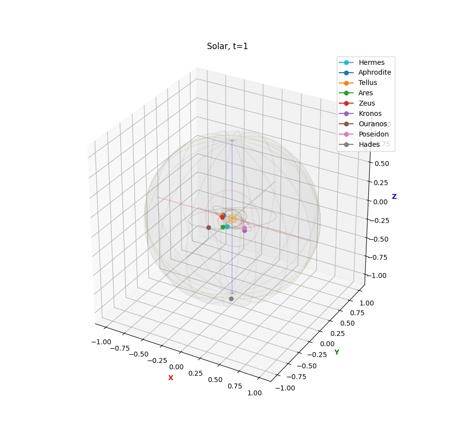

# Solar

Matplotlib 3D animation. Educational code.


## Screenshot




## Requirements

+ numpy
+ matplotlib


## Usage
```
usage: solar.py [-h] [-A] [-S] [-V] [-p PRECISION] [-f FPS]

optional arguments:
  -h, --help            show this help message and exit
  -A, --show-axis
  -S, --save-mp4
  -V, --verbose
  -p PRECISION, --precision PRECISION
  -f FPS, --fps FPS
```

# BUGS

Always.
